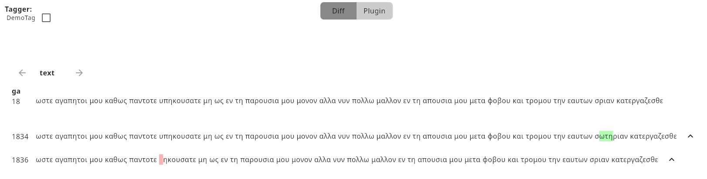
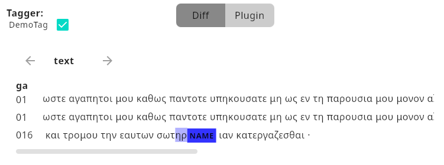
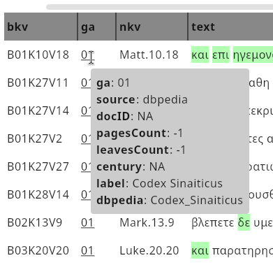
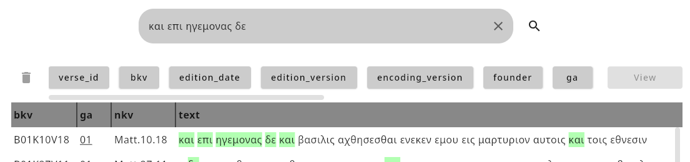

# Usage

All features of the tool in this section are described and demonstrated using the example data set referenced in the [installation section](installation.md).

## Load a Data Set

TODO

+ load data via the user interface
+ source files can be added with the 'Add' button (only csv files are supported at the moment, more file formats will be supported in the future)
+ source files can be removed with the 'Remove' button
+ configure:
  + fields
  + filter
  + variant mapping
+ Export
+ Import
+ Load

## Load a Plugin

To load a plugin, you have two options:
1. Use the 'Load Plugin' button in the burger menu in the top right corner of the main screen. A file dialog will open, allowing you to select the plugin jar file. Once selected, the plugin will be loaded and its functionality will be available in the application.
2. Manually place the plugin jar file in the `plugins` directory, which is located in the `.textexplorer` directory in your home directory. The plugin will be automatically loaded when you start the application.

## Exploration of Data

The exploration of data in this tool is divided into two main features: **Search** and **Insights**.

The **Search** functionality allows users to perform various types of searches, including normal, exact, boolean, field-specific, and variant searches, with options for pre-filtering results.

The **Insights** feature provides tools for comparing data through a diff and tagging view for better insights.

### Search

TODO

+ Normal Search
+ Exact Search
+ Boolean Search
+ Field Search
+ Variant Search
+ Pre filtering

### Insights

These features offer enhanced data insights. Specifically, the application highlights differences between selected entries per field and words or subwords tagged via the Tagging API (see [Development](dev.md)).

Insights can be accessed by selecting one or more entries in the result table, which enables the corresponding button in the top-right corner above the results. 

The diff view displays additions in green and deletions in red, providing a clear comparison between selected entries. The top entry serves as the baseline for comparison with the entries below. Use the arrow next to the text to promote a different entry for comparison. The arrow menu on the left side allows switching between fields. Plugins can define which fields are always visible (e.g., ga) and selectable (see [Development](dev.md)).

The Tagger can be enabled and switched in the top-left corner (e.g., DemoTag) and highlights matches with the corresponding tag provided by the plugin (see [Development](dev.md)).

UI extensions from plugins (see Development) are also available within the 'Insights' section. To access visualizations or insights provided by plugins, switch to the 'Plugins' tab located at the top-center (see images above). Switching between different plugin views is possible.

### Links

The fetched link information is displayed in the result table with underlined text. These fields are hoverable, revealing additional information about the corresponding object.

## Settings

A few settings are available in the burger menu in the top-right corner of the screen. These settings will mostly affect the user interface and how the data is displayed. These settings include:

+ **Width Limit**: Toggles between a fixed width for the result table and a dynamic width that adjusts to the content.
+ **Exact Highlighting**: Enables or disables exact highlighting of search results in the result table. When enabled, only exact matching terms will be highlighted in the result table. When disabled, even matching substrings will be highlighted.

Certain columns of the result table can be disabled to reduce clutter. These can be toggled on or off per column by clicking the corresponding button in the button list above the result table (e.g., verse_id, bkv, edition_date, edition_version, etc.).

The tool is able to manage multiple data sets at the same time. You can switch between data sets using the dropdown menu in the top-left corner of the screen.

The settings menu is likely to change in the future, so please check the documentation for updates.

## Logs

In case of a crash or other issues, the application logs its output to a file named `log.txt`. This file is located in the `.textexplorer` directory within your home directory. Please include this file when [reporting an issue](https://github.com/Paulanerus/TextExplorer/issues) on GitHub.